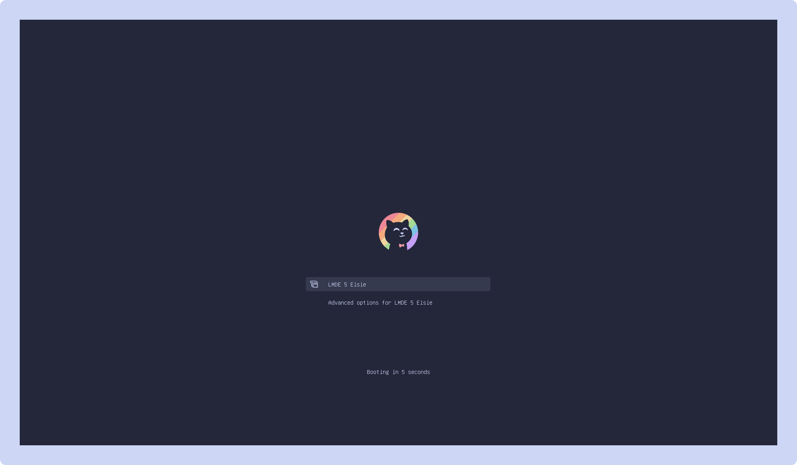
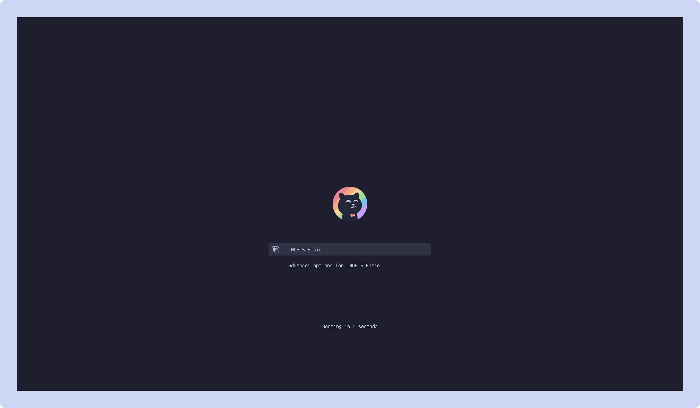

<h3 align="center">
  <br/>
  
  Catppuccin for <a href="https://www.gnu.org/software/grub/">Grub</a>
  
</h3>
<p align="center">
  <a href="https://github.com/catppuccin/grub/stargazers"></a>
  <a href="https://github.com/catppuccin/grub/issues"></a>
  <a href="https://github.com/catppuccin/grub/contributors"></a>
</p>

<p align="center">
  
</p>

## Previews

<details>
<summary>🌻 Latte</summary>
  
</details>
<details>
<summary>🪴 Frappé</summary>
  
</details>
<details>
<summary>🌺 Macchiato</summary>
  
</details>
<details>
<summary>🌿 Mocha</summary>
  
</details>

## Usage

1. Clone this repository locally and enter the cloned folder:

    ```shell
    git clone https://github.com/catppuccin/grub.git && cd grub
    ```

2. Copy all or selected theme from `src` folder to
`/usr/share/grub/themes/`. E.g. to copy all themes use:

    ```shell
    sudo cp -r src/* /usr/share/grub/themes/
    ```

3. Uncomment and edit following line in `/etc/default/grub` to your selected
   theme:

    ```shell
    GRUB_THEME="/usr/share/grub/themes/catppuccin-<flavor>-grub-theme/theme.txt"
    ```

4. Update grub:

    ```shell
    sudo grub-mkconfig -o /boot/grub/grub.cfg
    ```

    For Fedora:

    ```shell
    sudo grub2-mkconfig -o /boot/grub2/grub.cfg
    ```

## 💿 Ventoy Support

See instructions in the [ventoy directory](ventoy/).

## 🙋 FAQ

- Q: **_"How can I make Grub work with my screen resolution?"_**

  A: Uncomment and edit following line in `/etc/default/grub` (modify
  `1920x1080` to your screen resolution):

  ```shell
  GRUB_GFXMODE=1920x1080
  ```

  Proceed to update grub (see step 4 of the installation)

- Q: **_"How can I make Grub detect all my operating systems? (dual-boot)"_**

  A: Make sure you have `os-prober` installed. Add or uncomment following line
    in `/etc/default/grub` :

  ```shell
  GRUB_DISABLE_OS_PROBER=false
  ```

  Save that file and update grub (see step 4 of the installation)

- Q: **_"How can I make Grub detect my theme?"_**

  A: Make sure to **comment** the following line in `/etc/default/grub` like so:

  ```shell
  # GRUB_TERMINAL_OUTPUT="console"
  ```

  Save that file and update grub (step 4). If this did not work, try to replace
  `/usr/share/` with `/boot/` and repeat installation steps 2-4.

## 💝 Thanks to

- [Dooez](https://github.com/Dooez/ventoy-catppuccin)
- [vinceliuice](https://github.com/vinceliuice/grub2-themes)
- [tuhanayim](https://github.com/tuhanayim)

&nbsp;

<p align="center"></p>
<p align="center">Copyright &copy; 2021-present <a href="https://github.com/catppuccin" target="_blank">Catppuccin Org</a>
<p align="center"><a href="https://github.com/catppuccin/catppuccin/blob/main/LICENSE"></a></p>
