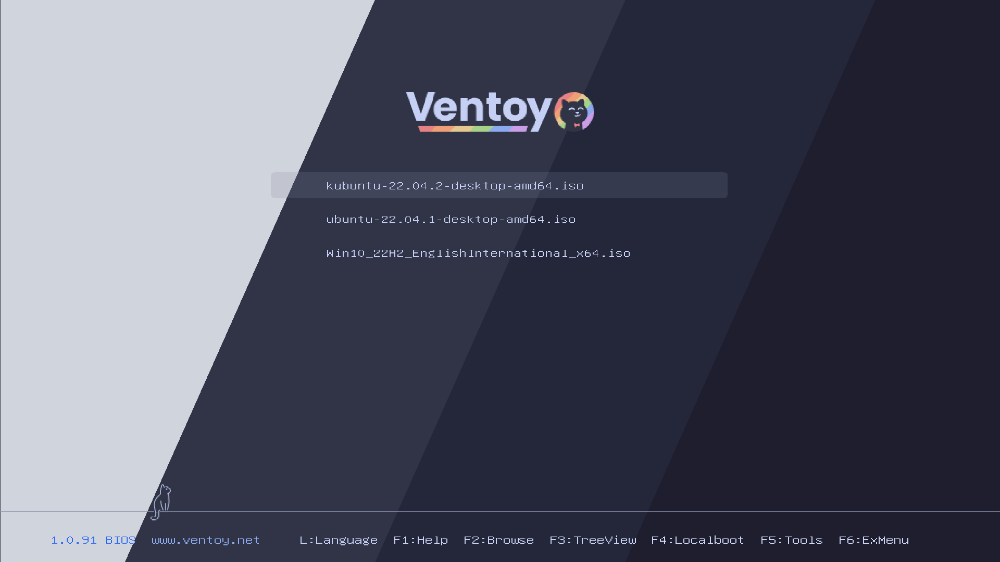
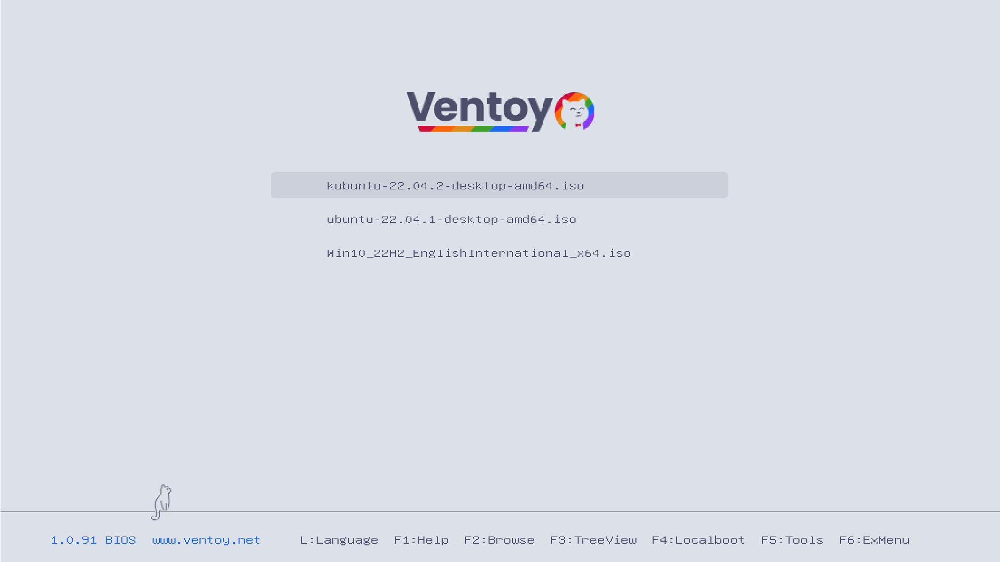
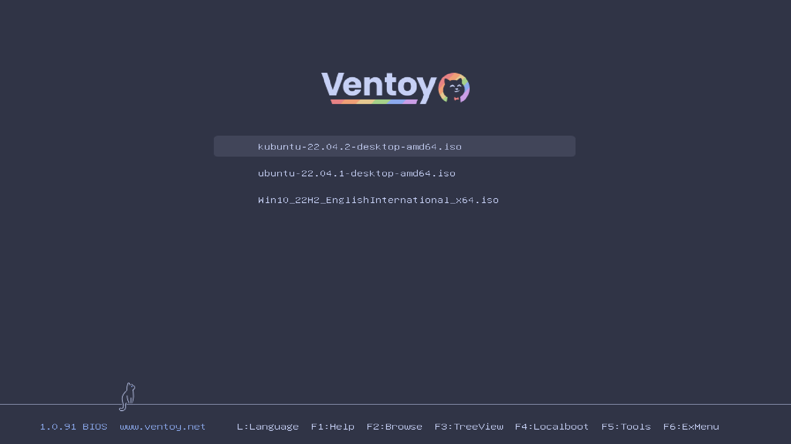
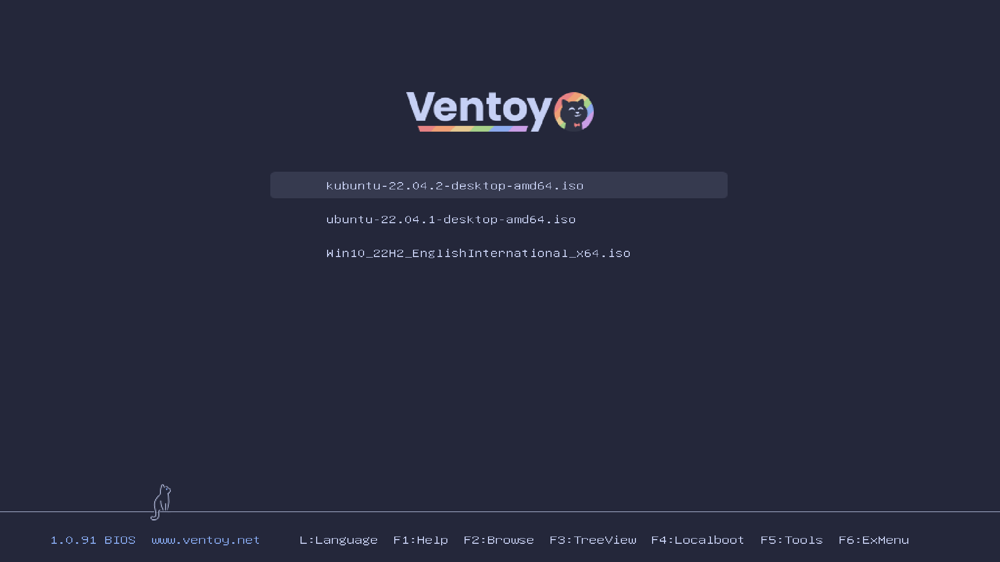
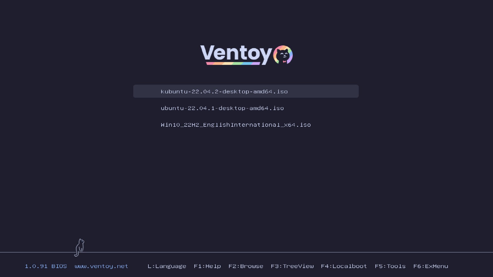

<h3 align="center">
   
  
  Catppuccin for <a href="https://www.ventoy.net/en/index.html">Ventoy</a>
  
</h3>

 

## Previews

🌻 Latte

  

🪴 Frappé

  

🌺 Macchiato

  

🌿 Mocha

  

## Usage

1. Clone this repository locally.
2. Choose flavor folder in [src/](src).
3. Copy `catppuccin-<flavor>` folder into `ventoy` folder on your ventoy drive. 
4. Copy `ventoy.json` into `ventoy` folder on your drive or merge with an existing file.

## Acknowledgement

Logo font is [Poppins](https://fonts.google.com/specimen/Poppins).

These themes are based on [Catppuccin for Grub](https://github.com/catppuccin/grub) and [Ventoy Purple Theme](https://github.com/odiegoduarte/ventoy-purple-theme)
